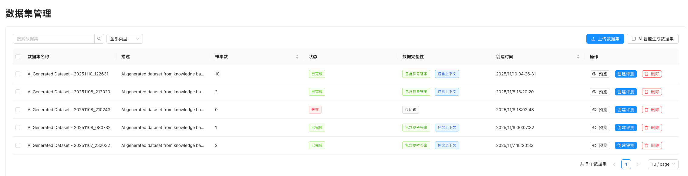
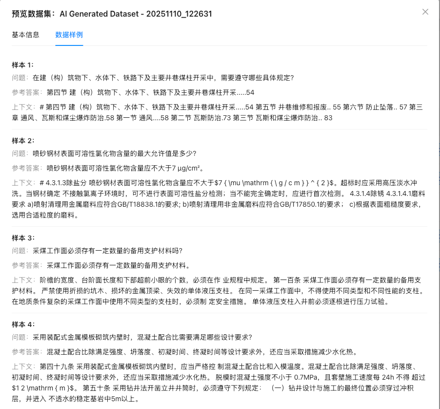
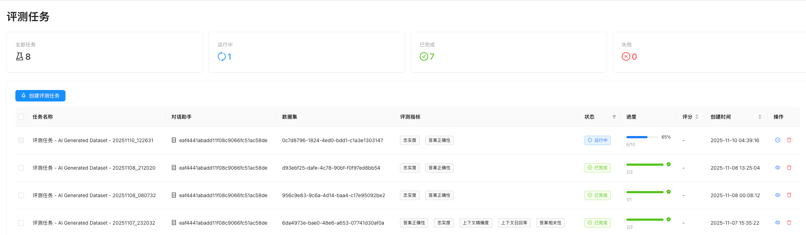
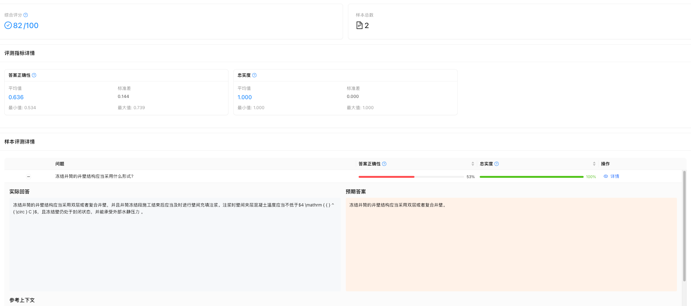

# RAG 评估系统

独立部署的 RAG (Retrieval-Augmented Generation) 系统评测工具，基于 RAGAS 框架构建。

## 🚀 特性

- **多系统支持**: 可与 RAGFlow、LangChain 等多种 RAG 系统集成
- **丰富指标**: 基于 RAGAS 框架的多种评测指标
- **可视化报告**: 直观的评测结果展示
- **批量评测**: 支持大规模数据集评测
- **实时监控**: 实时查看评测进度和结果

## 📋 评测指标

### LLM 基础指标
- **忠实度 (Faithfulness)**: 评估回答是否基于提供的上下文
- **答案相关性 (Answer Relevancy)**: 评估答案与问题的相关程度
- **上下文精确度 (Context Precision)**: 评估检索到的上下文与问题的相关性
- **上下文召回率 (Context Recall)**: 评估是否检索到回答问题所需的所有相关信息

### 传统指标
- **答案相似度 (Answer Similarity)**: 基于向量相似度的答案评估
- **响应时间 (Response Time)**: 系统响应速度评测
- **Token 使用量**: 计算资源消耗评估

## 🏗️ 系统架构

```
rag-evaluation/
├── backend/                 # 后端服务
│   ├── app.py              # Flask 应用入口
│   ├── config.py           # 配置文件
│   ├── evaluation.py       # 评测 API 路由
│   ├── services/           # 业务逻辑层
│   │   └── evaluation/     # 评测服务
│   └── requirements.txt    # Python 依赖
├── frontend/               # 前端界面
│   ├── src/
│   │   ├── components/     # React 组件
│   │   ├── pages/          # 页面组件
│   │   └── services/       # API 服务
│   ├── package.json        # Node.js 依赖
│   └── vite.config.ts      # Vite 配置
└── README.md              # 项目文档
```

## 🛠️ 安装部署

### 方式一：Docker 部署（推荐）⭐

**最简单的部署方式**，无需手动配置 Python 和 Node.js 环境。

#### 使用预构建镜像（推荐）

```bash
# 1. 克隆项目
git clone https://github.com/KnowFlowRAG/KnowEval.git
cd KnowEval/docker-deploy

# 2. 配置环境变量
cp .env.example .env
# 编辑 .env 文件，配置必要的 API 密钥

# 3. 启动服务（使用预构建镜像）
./start.sh

# 服务将在以下端口运行：
# - 前端: http://localhost:5003
# - 后端: http://localhost:5003/api
```

#### 快速命令

```bash
# 启动服务
./start.sh

# 停止服务
./stop.sh

# 更新镜像
./update.sh

# 备份数据
./backup.sh

# 查看日志
docker-compose logs -f
```

#### 自定义构建

如果需要修改代码后重新构建镜像：

```bash
# 1. 修改代码后，构建新镜像
cd KnowEval
docker build -t your-username/knoweval:latest .

# 2. 修改 docker-compose.yml 中的镜像名
# image: your-username/knoweval:latest

# 3. 启动服务
cd docker-deploy
docker-compose up -d
```

#### Docker 部署配置

在 `docker-deploy/.env` 中配置以下环境变量：

```bash
# 必需配置
RAGFLOW_BASE_URL=http://your-ragflow-host:9380
RAGFLOW_API_KEY=your-ragflow-api-key

# LLM API 配置（选择一个）
OPENAI_API_KEY=your-openai-key                    # OpenAI
SILICONFLOW_API_KEY=your-siliconflow-key         # SiliconFlow
DEEPSEEK_API_KEY=your-deepseek-key               # DeepSeek

# 数据持久化
VOLUME_PATH=./data                                 # 数据存储路径
```

#### Docker 架构

```
┌─────────────────────────────────────┐
│   Docker Container (Port 5003)      │
├─────────────────────────────────────┤
│  ┌─────────────┐  ┌──────────────┐ │
│  │   Nginx     │  │   Frontend   │ │
│  │  (Port 80)  │  │   (Built)    │ │
│  └──────┬──────┘  └──────────────┘ │
│         │                           │
│  ┌──────▼──────────────────────┐   │
│  │   Backend API (Port 5002)   │   │
│  │   - Flask Application       │   │
│  │   - RAGAS Evaluation        │   │
│  │   - SQLite Database         │   │
│  └─────────────────────────────┘   │
└─────────────────────────────────────┘
         │
         ▼
   [External Services]
   - RAGFlow API
   - LLM API (OpenAI/SiliconFlow/etc)
```

#### 数据持久化

Docker 部署会将以下数据挂载到宿主机：

```bash
docker-deploy/data/
├── evaluation.db          # SQLite 数据库
├── datasets/              # 上传的数据集
├── reports/               # 评测报告
└── logs/                  # 应用日志
```

#### 故障排查

```bash
# 查看容器状态
docker-compose ps

# 查看实时日志
docker-compose logs -f

# 重启服务
docker-compose restart

# 完全重建
docker-compose down
docker-compose up -d --build

# 进入容器调试
docker-compose exec knowflow-eval bash
```

更多 Docker 部署详情，请参考：[Docker 部署文档](docker-deploy/README.md)

---

### 方式二：源码部署

适合需要修改代码或深度定制的场景。

#### 后端部署

1. **环境准备**
```bash
# 克隆项目
cd rag-evaluation/backend

# 推荐：使用 Python 3.11 (与 pandas 兼容性最好)
python3 -m venv venv
source venv/bin/activate  # Linux/Mac
# 或 venv\Scripts\activate  # Windows

# 升级 pip
pip install --upgrade pip

# 安装依赖 (使用最小依赖避免编译问题)
pip install -r requirements-minimal.txt
```

2. **配置环境变量**
```bash
# 复制环境变量模板
cp ../.env.example .env

# 编辑配置文件
vim .env
```

3. **启动服务**
```bash
# 开发环境
python app_new.py

# 生产环境
gunicorn -w 4 -b 0.0.0.0:5002 app_new:app
```

### 前端部署

1. **环境准备**
```bash
cd rag-evaluation/frontend

# 安装依赖
npm install
# 或 yarn install
```

2. **配置环境变量**
```bash
# 复制环境变量模板
cp .env.example .env

# 根据需要修改配置
```

3. **启动服务**
```bash
# 开发环境
npm run dev

# 构建生产版本
npm run build
```

## 📊 产品功能

### 界面概览

#### 1. 评测仪表盘


评测仪表盘提供了全面的评测概览：
- **知识库进度**: 实时显示评测完成进度（75/100）
- **总评测次数**: 追踪历史评测记录（7次）
- **活跃数据集**: 管理使用中的数据集（5个）
- **平均耗时**: 监控评测性能（6.1分钟）
- **详细指标得分**:
  - 忠实度 (Faithfulness): 84.4%
  - 答案正确性 (Answer Correctness): 67.9%
  - 上下文精确度 (Context Precision): 55.2%
  - 上下文召回率 (Context Recall): 100%
  - 答案相关性 (Answer Relevancy): 43.8%
- **任务状态分布**: 实时监控运行中（1个）、已完成（7个）任务

#### 2. 数据集管理



强大的数据集管理功能：
- **批量导入**: 支持上传 JSON、CSV、Excel 格式数据集
- **AI 智能生成**: 基于知识库自动生成评测数据集
- **数据集状态**:
  - 已完成：可直接用于评测
  - 自动参考答案：系统自动生成参考答案
  - 问答上下文：包含问题、答案和上下文信息
- **样本数量**: 每个数据集包含 1-10 个测试样本
- **操作功能**: 预览、创建评测、删除数据集

#### 3. 数据集预览



详细的数据集内容展示：
- **问题**: 显示评测问题
- **参考答案**: 标准答案参考
- **上下文**: 检索到的相关文档片段（多个上下文来源）
- 支持查看完整的问答对和上下文内容

#### 4. 评测任务管理



全面的任务管理界面：
- **任务状态**:
  - 进行中：显示实时进度（65%）
  - 已完成：显示完成时间和结果
- **任务信息**:
  - 对话助手 ID
  - 数据集来源
  - 评测指标类型
- **创建评测**: 一键创建新的评测任务

#### 5. 评测报告



详细的评测结果分析：
- **综合评分**: 展示整体评测得分
- **知识库信息**: 显示评测的数据集来源
- **样本数量**: 统计评测样本总数
- **生成时间**: 记录报告生成时间戳
- **查看详情**: 深入分析每个指标的表现

## 📋 使用指南

### 1. 创建数据集

支持的文件格式：
- JSON (推荐)
- CSV
- Excel (.xlsx, .xls)

JSON 格式示例：
```json
[
  {
    "question": "什么是人工智能？",
    "expected_answer": "人工智能是计算机科学的一个分支...",
    "contexts": ["上下文信息1", "上下文信息2"],
    "reference_contexts": ["参考上下文1", "参考上下文2"]
  }
]
```

**AI 智能生成数据集**：
1. 进入数据集管理页面
2. 点击"AI 智能生成数据集"
3. 选择知识库和生成数量
4. 系统自动生成问答对和参考答案

### 2. 配置对话助手

系统支持从 RAGFlow 获取对话助手列表，确保：
- RAGFlow 服务正在运行
- 配置了正确的 RAGFLOW_API_KEY

### 3. 运行评测

1. 在评测仪表盘点击"创建评测测试"
2. 选择要评测的对话助手
3. 选择评测数据集
4. 选择评测指标（支持多选）：
   - 忠实度 (Faithfulness)
   - 答案正确性 (Answer Correctness)
   - 上下文精确度 (Context Precision)
   - 上下文召回率 (Context Recall)
   - 答案相关性 (Answer Relevancy)
5. 启动评测任务，实时查看进度

### 4. 查看报告

评测完成后，可以查看：
- **总体评分**: 各指标的平均得分和标准差
- **得分分布**: 可视化展示分数分布情况
- **详细分数**: 每个样本的具体评分
- **单个样本结果**: 查看问题、答案、上下文和各项指标得分
- **导出报告**: 支持导出 JSON 格式的完整报告

## 🔧 配置说明

### 后端配置

| 环境变量 | 说明 | 默认值 |
|---------|------|--------|
| `PORT` | 服务端口 | 5002 |
| `RAGFLOW_BASE_URL` | RAGFlow 服务地址 | http://localhost:9380 |
| `RAGFLOW_API_KEY` | RAGFlow API 密钥 | - |
| `OPENAI_API_KEY` | OpenAI API 密钥 | - |
| `SILICONFLOW_API_KEY` | 硅基流动 API 密钥 | - |
| `DEFAULT_LLM_MODEL` | 默认 LLM 模型 | Qwen/Qwen2.5-32B-Instruct |

### 前端配置

| 环境变量 | 说明 | 默认值 |
|---------|------|--------|
| `VITE_API_BASE_URL` | 后端 API 地址 | http://localhost:5002/api/v1 |
| `VITE_RAGFLOW_API_URL` | RAGFlow API 地址 | http://localhost:9380/api/v1 |

## 🚀 快速开始

### 方式一：Docker 一键部署 ⭐ (推荐)

**最快 3 分钟完成部署！**

```bash
# 1. 克隆项目
git clone https://github.com/KnowFlowRAG/KnowEval.git
cd KnowEval/docker-deploy

# 2. 配置环境变量（必需）
cp .env.example .env
# 编辑 .env，添加以下配置：
#   - RAGFLOW_BASE_URL 和 RAGFLOW_API_KEY
#   - 至少配置一个 LLM API (OpenAI/SiliconFlow/DeepSeek)

# 3. 启动服务
./start.sh

# ✅ 完成！访问 http://localhost:5003
```

**Docker 部署优势**：
- ✅ 无需安装 Python、Node.js
- ✅ 一键启动，自动配置
- ✅ 数据持久化，支持备份
- ✅ 生产环境就绪

### 方式二：源码开发部署

适合需要修改代码的开发者。

#### 自动安装脚本

```bash
cd KnowEval
./install.sh  # 自动安装所有依赖

# 启动系统
./start.sh dev

# 访问系统
# - 前端: http://localhost:3001
# - 后端: http://localhost:5002
```

#### 手动安装

<details>
<summary>展开查看手动安装步骤</summary>

**1. 后端环境准备**
```bash
cd KnowEval/backend

# 推荐使用 Python 3.10
python3.10 -m venv venv
source venv/bin/activate  # Linux/Mac
# 或 venv\Scripts\activate  # Windows

# 安装依赖
pip install --upgrade pip
pip install -r requirements.txt
```

**2. 前端环境准备**
```bash
cd KnowEval/frontend

# 安装依赖
npm install
# 或 yarn install
```

**3. 启动服务**
```bash
# 后端（终端1）
cd backend
source venv/bin/activate
python app_new.py

# 前端（终端2）
cd frontend
npm run dev
```

**4. 访问系统**
- 前端界面: http://localhost:3001
- 后端 API: http://localhost:5002
- API 文档: http://localhost:5002/api/v1/evaluation/docs

</details>

### ⚠️ Python 版本说明
- **推荐**: Python 3.10 (兼容性最佳，无编译问题)
- **支持**: Python 3.8 - 3.12
- **问题**: Python 3.13 存在较多兼容性问题

强烈建议使用 Python 3.10：
```bash
# 使用 pyenv 安装和管理 Python 版本
brew install pyenv
pyenv install 3.10.14
pyenv local 3.10.14
```

## 🤝 贡献指南

1. Fork 本仓库
2. 创建特性分支 (`git checkout -b feature/AmazingFeature`)
3. 提交更改 (`git commit -m 'Add some AmazingFeature'`)
4. 推送到分支 (`git push origin feature/AmazingFeature`)
5. 打开 Pull Request

## 📄 许可证

本项目基于 GNU Affero General Public License v3.0 (AGPL-3.0) 开源。

**AGPL-3.0 主要特点**：
- ✅ 允许商业使用
- ✅ 允许修改和分发
- ✅ 允许专利使用
- ⚠️ 修改后的代码必须开源
- ⚠️ 网络服务也需要提供源代码
- ⚠️ 衍生作品必须使用相同许可证

查看完整许可证内容：[LICENSE](LICENSE)

如需商业授权或其他许可选项，请联系项目维护者。

## 🆘 支持

如果您遇到问题或有建议，请：
1. 查看 [常见问题](docs/FAQ.md)
2. 提交 [Issue](https://github.com/your-repo/rag-evaluation/issues)
3. 联系维护者

## 🎯 路线图

- [ ] 支持更多 RAG 系统
- [ ] 添加更多评测指标
- [ ] 支持自定义评测模板
- [ ] 增加团队协作功能
- [ ] 支持评测结果对比
- [ ] 添加性能基准测试